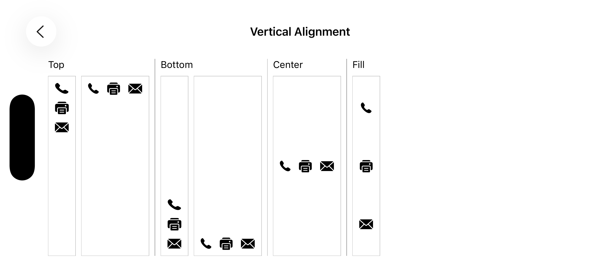
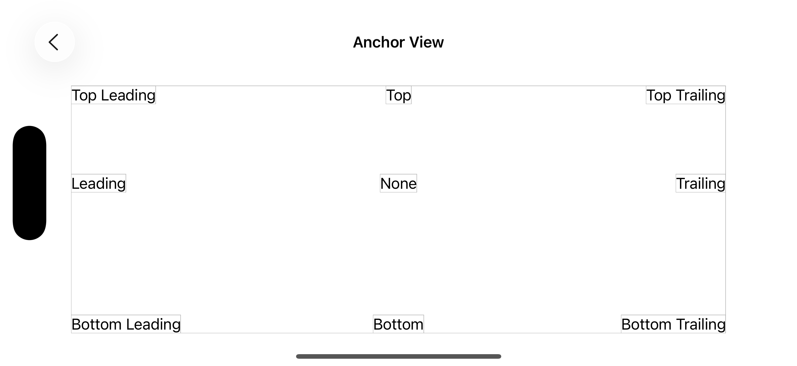
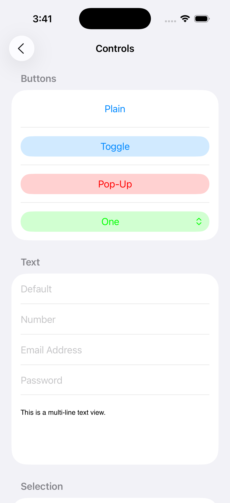

[](https://github.com/HTTP-RPC/Lima/releases)

# Introduction
Lima is a Swift package for simplifying development of UIKit-based iOS applications. The project's name comes from the nautical _L_ or _Lima_ flag, representing the first letter of the word "layout":


For example, the following code creates an instance of Lima's `LMColumnView` class containing an image view and a label:

```swift
let columnView = LMColumnView(
    UIImageView(image: UIImage(named: "world.png"), contentMode: .scaleAspectFit),
    UILabel(text: "Hello, World!", textAlignment: .center)
)
```

The result is shown below:


The complete source code for this example can be found [here](LimaTest/GreetingViewController.swift).

Lima requires iOS 16 or later.

# Lima Classes
Auto layout in UIKit is implemented via layout constraints, which, while powerful, are not particularly convenient to work with. To simplify the process, Lima provides a set of view classes whose sole responsibility is managing the size and position of their respective subviews. These classes use layout constraints internally, allowing developers to easily take advantage of auto layout while eliminating the need to manage constraints directly:

* `LMRowView` - arranges subviews in a horizontal line, optionally aligning to baseline
* `LMColumnView` - arranges subviews in a vertical line, optionally aligning nested elements to a grid
* `LMAnchorView` - anchors subviews to one or more edges

Additionally, the `LMSpacer` class can be used to create fixed or flexible space between other views.

Lima adds the following properties to `UIView` to control how subviews are sized and positioned by a layout view:

* `width` - assigns a fixed width to a view
* `height` - assigns a fixed height to a view
* `weight` - when used with row and column views, determines how excess space is allocated within the parent
* `anchor` - when used with anchor views, determines the edges to which the view will be anchored within the parent

Lima also provides the following classes to simplify the use of some common UIKit types:
 
* `LMScrollView` - extends `UIScrollView` to automatically adapt to content size
* `LMTableViewCell` - extends `UITableViewCell` to automatically pin content to edges
* `LMTableViewHeaderFooterView` - extends `UITableViewHeaderFooterView` to automatically pin content to edges

Finally, Lima adds initializers to common UIKit views and controls to simplify their declaration in a view hieararchy. These initializers support callbacks that can be used to further customize the instantiated views and are discussed in more detail [later](#initializer-callbacks).

## LMRowView and LMColumnView
The `LMRowView` and `LMColumnView` classes arrange subviews in a horizontal or vertical line, respectively. Both classes extend the abstract `LMBoxView` class, which defines the following properties:

* `horizontalAlignment`
* `verticalAlignment`
* `spacing`

Horizontal alignment options include `fill`, `leading`, `trailing`, and `center`. Vertical alignment options include `fill`, `top`, `bottom`, and `center`. Both values are set to `fill` by default, which pins subviews along both of the box view's axes. Other values pin subviews to a single edge or center them along a given axis:


<br/>


The `spacing` property defines the amount of space reserved between subviews. For row views, this refers to the horizontal space between the subviews; for column views, it refers to the vertical space. If unspecified, a default (system-dependent) value will be used.

### Baseline Alignment
The `isAlignToBaseline` property enables baseline alignment in a row view. When this property is set to `true`, subviews are aligned to their respective baselines rather than the top or bottom egdes of the row. For [example](LimaTest/BaselineAlignment.swift):


### Grid Alignment
The `isAlignToGrid` property enables grid alignment in a column view. When this property is set to `true`, the subviews of every `LMRowView` in the column are vertically aligned in a grid, as in a spreadsheet or HTML table. For [example](LimaTest/GridAlignmentViewController.swift):


### View Weights
Often, a row or column view will be given more space than it needs to accommodate the intrinsic sizes of its subviews. The `weight` property can be used to specify the amount of excess space that should be allocated to a subview, relative to other weighted subviews. For row views, weights apply to the excess horizontal space, and for column views to the excess vertical space.

Note that explicitly defined width and height values take priority over weights. If a view has both a weight and a fixed dimension, the weight value will be ignored.
 
## LMAnchorView
The `LMAnchorView` class optionally anchors subviews to one or more of its own edges. For [example](LimaTest/AnchorViewController.swift): 



Anchors are specified as an option set that defines the edges to which the view will be anchored within the parent. If no anchor is specified for a given dimension, the subview will be centered within the parent for that dimension.

## LMSpacer
The `LMSpacer` class has a default weight of 1 and is typically used to create flexible space between other views. However, the `width` and `height` properties can be used to assign a fixed size to a spacer view. For example, this code creates a half-pixel wide spacer with a gray background:

```swift
LMSpacer(width: 0.5, backgroundColor: .gray)
```

## LMScrollView
The `LMScrollView` class extends `UIScrollView` to simplify the declaration of scrollable content. The following properties determine how the content will be presented:

* `isFitToWidth`
* `isFitToHeight` 

When both values are `false` (the default), the scroll view will automatically display scroll bars when needed, allowing the user to pan in both directions to see the content in its entirety. 

When `fitToWidth` is set to `true`, the scroll view will ensure that the width of its content matches the width of its adjusted content area, causing the content to wrap and scroll in the vertical direction only. The vertical scroll bar will appear when necessary, and the horizontal scroll bar will never be shown.

When `fitToHeight` is `true`, the scroll view will ensure that the height of its content matches the height of its adjusted content area, causing the content to wrap and scroll in the horizontal direction only. The horizontal scroll bar will appear when necessary, and the vertical scroll bar will never be shown.

Setting both properties to `true` produces the same behavior as anchoring a subview to all sides of an `LMAnchorView`.

## LMTableViewCell and LMTableViewHeaderFooterView
The `LMTableViewCell` and `LMTableViewHeaderFooterView` classes facilitate the declaration of custom table view content. For [example](LimaTest/ControlsViewController.swift):



They can also be used as the base class for custom cell and header/footer view classes. For [example](LimaTest/TableViewCellController.swift):


# Initializer Callbacks
All Lima initializers provide a trailing closure that can be used to further customize the instantiated view. This callback is automatically invoked by the initializer before it returns. 

A common use of initializer callbacks is to associate view instances with controller member variables, or "outlets". For [example](LimaTest/ActionViewController.swift):


