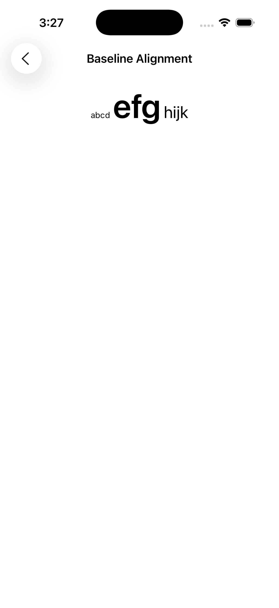
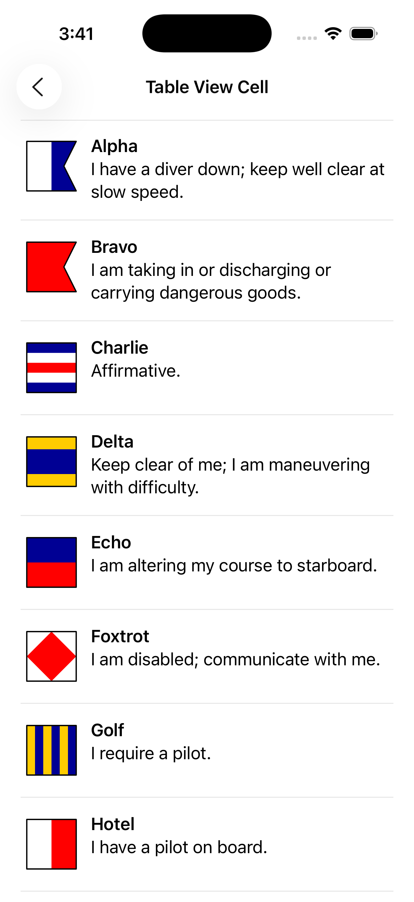

[](https://github.com/HTTP-RPC/Lima/releases)

# Introduction
Lima is a Swift package for simplifying development of UIKit-based iOS applications. The project's name comes from the nautical _L_ or _Lima_ flag, representing the first letter of the word "layout":


For example, the following code creates an instance of Lima's `LMColumnView` class containing an image view and a label:

```swift
let columnView = LMColumnView(
    UIImageView(image: UIImage(named: "world.png"), contentMode: .scaleAspectFit),
    UILabel(text: "Hello, World!", textAlignment: .center)
)
```

The result is shown below:


The complete source code for this example can be found [here](LimaTest/GreetingViewController.swift).

Lima requires iOS 16 or later.

# Lima Classes
Auto layout in UIKit is implemented via layout constraints, which, while powerful, are not particularly convenient to work with. To simplify the process, Lima provides a set of view classes whose sole responsibility is managing the size and position of their respective subviews. These classes use layout constraints internally, allowing developers to easily take advantage of auto layout while eliminating the need to manage constraints directly:

* `LMRowView` - arranges subviews in a horizontal line, optionally aligning to baseline
* `LMColumnView` - arranges subviews in a vertical line, optionally aligning nested elements to a grid
* `LMAnchorView` - anchors subviews to one or more edges

Additionally, the `LMSpacer` class can be used to create fixed or flexible space between other views.

For example, the periodic table shown below was constructed using a combination of Lima's layout views and `UILabel` instances:


Lima adds the following properties to `UIView` to customize how subviews are sized and positioned within a parent view:

* `width` - assigns a fixed width to a view
* `height` - assigns a fixed height to a view
* `weight` - when used with row and column views, determines how excess space is allocated within the parent
* `anchor` - when used with anchor views, determines the edges to which the view will be anchored within the parent
* `isDisplayable` - determines whether the view will participate in auto layout (`true` by default)

Lima also provides the following classes to simplify the use of some common UIKit types:
 
* `LMScrollView` - extends `UIScrollView` to automatically adapt to content size
* `LMTableViewCell` - extends `UITableViewCell` to automatically pin content to edges
* `LMTableViewHeaderFooterView` - extends `UITableViewHeaderFooterView` to automatically pin content to edges

Finally, Lima adds initializers to common UIKit views and controls to simplify their declaration in a view hieararchy. These initializers support callbacks that can be used to further customize the instantiated views. Initializer callbacks are discussed in more detail [later](#initializer-callbacks).

## LMLayoutView
`LMLayoutView` is the base class for all layout views in Lima. Among other things, it provides the following initializer, which is used to establish the view's layout margins:

```swift
public convenience init(margin: CGFloat?,
    topMargin: CGFloat?,
    leadingMargin: CGFloat?,
    bottomMargin: CGFloat?,
    trailingMargin: CGFloat?) { 
    ... 
}
```

The first argument specifies a value to apply to all margins. The remaining arguments specify the value for a particular edge. If no value is specified, the default is 0.

Subclasses of `LMLayoutView` provide a default of `nil` for all margin values. This allows a layout view's margins to be conveniently established at creation time. For example:

```swift
LMColumnView(margin: 8, leadingMargin: 12, trailingMargin: 12,
    ...
)
```

By default, layout views do not consume touch events. Touches that occur within the layout view but do not intersect with a subview are ignored, allowing the event to pass through the view. Assigning a non-`nil` background color to a layout view will cause the view to begin consuming events.

## LMRowView and LMColumnView
The `LMRowView` and `LMColumnView` classes lay out subviews in a horizontal or vertical line, respectively. Both classes extend the abstract `LMBoxView` class, which itself extends `LMLayoutView` and adds the following properties:

* `horizontalAlignment`
* `verticalAlignment`
* `spacing`

The first two properties specify the horizontal and vertical alignment, respectively, of the box view's subviews. Horizontal alignment options include `fill`, `leading`, `trailing`, and `center`. Vertical alignment options include `fill`, `top`, `bottom`, and `center`. Both values are set to `fill` by default, which pins subviews along both of the box view's axes. Other values pin subviews to a single edge or center them along a given axis:


<br/>


The `spacing` property represents the amount of space reserved between successive subviews. For row views, this refers to the horizontal space between the subviews; for column views, it refers to the vertical space. If unspecified, a default (system-dependent) spacing value will be used.

### LMRowView
The `LMRowView` class arranges its subviews in a horizontal line. Subviews are laid out from leading to trailing edge in the order in which they are declared. If the row's vertical alignment is set to `fill` (the default), the top and bottom edges of each subview will be pinned to the top and bottom edges of the row (excluding layout margins), ensuring that all of the labels are the same height. Otherwise, the subviews will be vertically aligned according to the specified value.

The `isAlignToBaseline` property is used to toggle baseline alignment in row views:



This code creates a row view containing three labels with different font sizes. Because `isAlignToBaseline` is set to `true`, the baselines of all three labels will line up, as shown above:

```swift
LMRowView(spacing: 4, isAlignToBaseline: true,
    LMSpacer(),
    UILabel(text: "abcd", font: .systemFont(ofSize: 12)),
    UILabel(text: "efg", font: .boldSystemFont(ofSize: 48)),
    UILabel(text: "hijk", font: .systemFont(ofSize: 24)),
    LMSpacer()
)
```

Spacer views are discussed in more detail [later](#lmspacer).

The baseline to which subviews will be aligned can be controlled by the `baseline` property. The default value is `first`, meaning that subviews will be aligned to the first baseline. However, it is also possible to align subviews to the last baseline; for example:

```swift
LMRowView(isAlignToBaseline: true, baseline: .last,
    ...
)
```

### LMColumnView
The `LMColumnView` class arranges its subviews in a vertical line. Subviews are laid out from top to bottom in the order in which they are declared. If the column's horizontal alignment is set to `fill` (the default), the left and right edges of each subview will be pinned to the left and right edges of the column (excluding layout margins), ensuring that all of the labels are the same width. Otherwise, the subviews will be horizontally aligned according to the specified value.

The `isAlignToGrid` property is used to toggle grid alignment in column views. When this property is set to `true`, subviews of successive rows will be sized to match the width of the widest subview in the column. For [example](LimaTest/GridAlignmentViewController.swift):


Column view subviews that are not `LMRowView` instances are excluded from alignment. This allows them to be used as section breaks or headers, for example.

### View Weights
Often, a row or column view will be given more space than it needs to accommodate the intrinsic sizes of its subviews. Lima adds a `weight` property to `UIView` that is used to determine how the extra space should be allocated. This value specifies the amount of excess space the view would like to be given within its superview (once the sizes of all unweighted views have been determined) and is relative to all other weights specified within the superview. For row views, weight applies to the excess horizontal space, and for column views to the excess vertical space.

### Fixed Dimensions
Although views are typically arranged based on their intrinsic content sizes, it is occasionally necessary to assign a fixed value for a particular view dimension. Lima adds the `width` and `height` properties to `UIView` to support explicit size definition.

Explicitly defined width and height values take priority over weights. If a view has both a weight and a fixed dimension value, the weight value will be ignored.

## LMSpacer
The `LMSpacer` class has a default weight of 1 and is typically used to create flexible space between other views. However, the `width` and `height` properties can be used to assign a fixed size to a spacer view. For example, this code creates a half-pixel wide spacer with a gray background:

```swift
LMSpacer(width: 0.5, backgroundColor: .gray)
```

Like layout views, spacer views do not consume touch events by default, so they will not interfere with any user interface elements that appear underneath them. Assigning a non-`nil` background color to a spacer view causes the view to begin consuming events.
 
## LMAnchorView
The `LMAnchorView` class optionally anchors subviews to one or more of its own edges: 


Although it is possible to achieve similar layouts using a combination of row, column, and spacer views, anchor views offer a simpler alternative in some cases. `LMAnchorView` is also the only layout container that supports Z-ordering.

Anchors are specified as an option set that defines the edges to which the view will be anchored within its parent. If no anchor is specified for a given dimension, the subview will be centered within the anchor view for that dimension.

The complete source code for the above example can be found [here](LimaTest/AnchorViewController.swift).

## LMScrollView
The `LMScrollView` class extends `UIScrollView` to simplify the declaration of scrollable content. It presents a single content view, optionally allowing the user to scroll in one or both directions.

The `isFitToWidth` and `isFitToHeight` properties determine how the content will be presented. When both values are set to `false` (the default), the scroll view will automatically display scroll bars when needed, allowing the user to pan in both directions to see the content in its entirety. 

When `fitToWidth` is set to `true`, the scroll view will ensure that the width of its content matches the width of its adjusted content area, causing the content to wrap and scroll in the vertical direction only. The vertical scroll bar will be displayed when necessary, but the horizontal scroll bar will never be shown, since the width of the content will never exceed the width of the scroll view:

When `fitToHeight` is `true`, the scroll view will ensure that the height of its content matches the height of its adjusted content area, causing the content to wrap and scroll in the horizontal direction only. The vertical scroll bar will never be shown, and the horizontal scroll bar will appear when necessary.

Setting both properties to `true` produces the same behavior as anchoring a subview to all sides of an `LMAnchorView`.

## LMTableViewCell and LMTableViewHeaderFooterView
The `LMTableViewCell` and `LMTableViewHeaderFooterView` classes facilitates the declaration of custom table view content. They can also be used as the base class for custom cell and header/footer view classes. For example:



The complete source code for this example can be found [here](LimaTest/TableViewCellController.swift).

When the `selectionStyle` property of an `LMTableViewCell` instance is set to `none`, the cell will not consume touch events. Touches that occur within the cell but do not intersect with a subview are ignored, preventing selection.

# Initializer Callbacks
All Lima initializers provide a trailing closure that can be used to further customize the instantiated view. This callback is automatically invoked by the initializer before it returns. 

A common use of initializer callbacks is to associate view instances with controller member variables, or "outlets". For example:

```swift
UISlider(primaryAction: UIAction() { [unowned self] action in
    sliderValueChanged()
}) {
    slider = $0
}
```


See the [controls](LimaTest/ControlsViewController.swift) example for more information.
