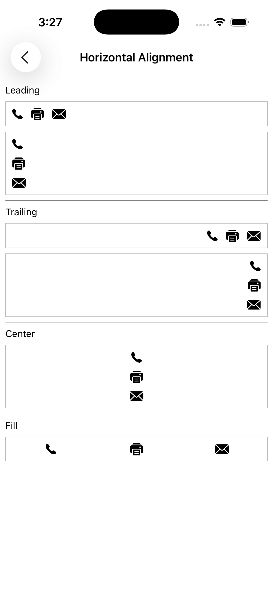

[](https://github.com/HTTP-RPC/Lima/releases)

# Introduction
Lima is an open-source framework for simplifying development of responsive iOS and macOS applications. It combines the productivity of a SwiftUI-like DSL with the flexibility of the UIKit framework. The project's name comes from the nautical _L_ or _Lima_ flag, representing the first letter of the word "layout":


This guide introduces the Lima framework and provides an overview of its key features.

# Contents
* [Getting Lima](#getting-lima)
* [Lima Classes](#lima-classes)
    * [LMLayoutView](#lmlayoutview)
    * [LMRowView and LMColumnView](#lmrowview-and-lmcolumnview)
    * [LMSpacer](#lmspacer)
    * [LMAnchorView](#lmanchorview)
    * [LMScrollView](#lmscrollview)
    * [LMTableViewCell and LMTableViewHeaderFooterView](#lmtableviewcell-and-lmtableviewheaderfooterview)
* [Initializer Callbacks](#initializer-callbacks)
* [Additional Information](#additional-information)

# Getting Lima
Lima is distributed as an XCFramework. iOS 14 or macOS 11 or later is required. To install:

* Download the [latest release](https://github.com/HTTP-RPC/Lima/releases) archive and expand
* In Xcode, select the project root node in the Project Navigator view
* Select the application target
* Select the "General" tab
* Drag _Lima.xcframework_ to the "Embedded Binaries" section
* In the dialog that appears, ensure that "Copy items if needed" is checked and click "Finish"

# Lima Classes
Auto layout is a UIKit feature that allows developers to create applications that automatically adapt to device size, orientation, or content changes. An application built using auto layout generally has little or no hard-coded view positioning logic, but instead dynamically arranges user interface elements based on their preferred or "intrinsic" content sizes.

Auto layout in UIKit is implemented via layout constraints, which, while powerful, are not particularly convenient to work with. To simplify the process, Lima provides a set of view classes whose sole responsibility is managing the size and position of their respective subviews:

* `LMRowView` - arranges subviews in a horizontal line
* `LMColumnView` - arranges subviews in a vertical line
* `LMAnchorView` - anchors subviews to one or more edges

These classes use layout constraints internally, allowing developers to easily take advantage of auto layout while eliminating the need to manage constraints directly. They can be nested to create complex layouts that automatically adjust to orientation or screen size changes. 

For example, the periodic table shown below was constructed using a combination of Lima's layout views and `UILabel` instances:


Lima adds the following properties to `UIView` to customize how subviews are sized and positioned within a parent view:

* `width` - assigns a fixed width to a view
* `height` - assigns a fixed height to a view
* `weight` - when used with row and column views, determines how excess space is allocated within the parent
* `anchor` - when used with anchor views, determines the edges to which the view will be anchored within the parent
* `isDisplayable` - determines whether the view will participate in auto layout (`true` by default)

Additionally, the `LMSpacer` class can be used to create fixed or flexible space between other views.

Lima also provides the following view classes to simplify the use of several common UIKit types:
 
* `LMScrollView` - extends `UIScrollView` to automatically adapt to content size
* `LMTableViewCell` - extends `UITableViewCell` to automatically pin content to edges
* `LMTableViewHeaderFooterView` - extends `UITableViewHeaderFooterView` to automatically pin content to edges

Finally, Lima adds initializers to common UIKit views and controls to simplify their declaration in a view hieararchy. 

For example, the following Swift code creates an instance of `LMColumnView` containing a `UIImageView` and a `UILabel`:

```swift
let columnView = LMColumnView(
    UIImageView(image: UIImage(named: "world.png"), contentMode: .scaleAspectFit),
    UILabel(text: "Hello, World!", textAlignment: .center)
)
```


The same result could also be achieved as shown below:

```swift
let columnView = LMColumnView()

let imageView = UIImageView()

imageView.image = UIImage(named: "world.png")
imageView.contentMode = .scaleAspectFit

columnView.addSubview(imageView)

let label = UILabel()

label.text = "Hello, World!"
label.textAlignment = .center

columnView.addSubview(label)
```

Although the two examples produce identical results, the first version is much more concise and easier to read.

Lima's initializers also support callbacks that can be used to further customize the instantiated views. Initializer callbacks are discussed in more detail [later](#initializer-callbacks).

## LMLayoutView
`LMLayoutView` is the base class for all layout views in Lima. Among other things, it provides the following initializer, which is used to establish the view's layout margins:

```swift
public convenience init(margin: CGFloat?,
    topMargin: CGFloat?,
    leadingMargin: CGFloat?,
    bottomMargin: CGFloat?,
    trailingMargin: CGFloat?) { 
    ... 
}
```

The first argument specifies a value to apply to all margins. The remaining arguments specify the value for a particular edge. If no value is specified, the default is 0.

Subclasses of `LMLayoutView` provide a default of `nil` for all margin values. This allows a layout view's margins to be conveniently established at creation time. For example:

```swift
LMColumnView(margin: 8, leadingMargin: 12, trailingMargin: 12,
    ...
)
```

By default, layout views do not consume touch events. Touches that occur within the layout view but do not intersect with a subview are ignored, allowing the event to pass through the view. Assigning a non-`nil` background color to a layout view will cause the view to begin consuming events.

## LMRowView and LMColumnView
The `LMRowView` and `LMColumnView` classes lay out subviews in a horizontal or vertical line, respectively. Both classes extend the abstract `LMBoxView` class, which itself extends `LMLayoutView` and adds the following properties:

```swift
var horizontalAlignment: LMHorizontalAlignment
var verticalAlignment: LMVerticalAlignment

var spacing: CGFloat

var isAlignToBaseline: Bool
```

The first two properties specify the horizontal and vertical alignment, respectively, of the box view's subviews. Horizontal alignment options include `fill`, `leading`, `trailing`, and `center`. Vertical alignment options include `fill`, `top`, `bottom`, and `center`. Both values are set to `fill` by default, which pins subviews along both of the box view's axes. Other values pin subviews to a single edge or center them along a given axis:



<br/>


For example, the following code creates a row view containing three labels that are aligned horizontally to the row's leading edge and vertically to the top of the row:

```swift
LMRowView(horizontalAlignment: .leading, verticalAlignment: .top,
    UILabel(text: "One"),
    UILabel(text: "Two"),
    UILabel(text: "Three")
)
```

The `spacing` property represents the amount of space reserved between successive subviews. For row views, this refers to the horizontal space between the subviews; for column views, it refers to the vertical space between the views. 

This code creates a row view whose labels will each be separated by a gap of 16 pixels:

```swift
LMRowView(spacing: 16,
    UILabel(text: "One"),
    UILabel(text: "Two"),
    UILabel(text: "Three")
)
```

If unspecified, the default (system-dependent) spacing value will be used.

Spacer views can also be used to align subviews or create fixed space within a row or column. This is discussed in more detail [later](#lmspacer).

The `isAlignToBaseline` property enables baseline alignment in a row or column view. It is set to `false` by default. Baseline alignment is discussed in more detail below. 

### LMRowView
The `LMRowView` class arranges its subviews in a horizontal line. Subviews are laid out from leading to trailing edge in the order in which they are declared. For example, the following code creates a row view containing three labels:

```swift
LMRowView(
    UILabel(text: "One"),
    UILabel(text: "Two"),
    UILabel(text: "Three")
)
```

If the row view's vertical alignment is set to `fill` (the default), the top and bottom edges of each subview will be pinned to the top and bottom edges of the row (excluding layout margins), ensuring that all of the labels are the same height. Otherwise, the subviews will be vertically aligned according to the specified value.

### LMColumnView
The `LMColumnView` class arranges its subviews in a vertical line. Subviews are laid out from top to bottom in the order in which they are declared. For example, the following code creates a column view containing three labels:

```swift
LMColumnView(
    UILabel(text: "One"),
    UILabel(text: "Two"),
    UILabel(text: "Three")
)
```

If the column view's horizontal alignment is set to `fill` (the default), the left and right edges of each subview will be pinned to the left and right edges of the column (excluding layout margins), ensuring that all of the labels are the same width. Otherwise, the subviews will be horizontally aligned according to the specified value.

### Baseline Alignment
The `isAlignToBaseline` property is used to toggle baseline alignment in row and column views:


This code creates a row view containing three labels with different font sizes. Because `isAlignToBaseline` is set to `true`, the baselines of all three labels will line up, as shown above:

```swift
LMRowView(isAlignToBaseline: true,
    UILabel(text: "abcd", font: UIFont.systemFont(ofSize: 16)),
    UILabel(text: "efg", font: UIFont.systemFont(ofSize: 32)),
    UILabel(text: "hijk", font: UIFont.systemFont(ofSize: 24))
)
```

The baseline to which subviews will be aligned can be controlled by the `baseline` property. The default value is `first`, meaning that subviews will be aligned to the first baseline. However, it is also possible to align subviews to the last baseline; for example:

```swift
LMRowView(isAlignToBaseline: true, baseline: .last,
    ...
)
```

This code creates a column view containing three labels with different font sizes. Because `isAlignToBaseline` is set to `true`, the labels will be spaced vertically according to their first and last baselines rather than their bounding rectangles:

```swift
LMColumnView(isAlignToBaseline: true,
    UILabel(text: "abcd", font: UIFont.systemFont(ofSize: 16)),
    UILabel(text: "efg", font: UIFont.systemFont(ofSize: 32)),
    UILabel(text: "hijk", font: UIFont.systemFont(ofSize: 24))
)
```

### Grid Alignment
`LMColumnView` defines the following additional property, which specifies that nested subviews should be vertically aligned in a grid, like an HTML table: 

```swift
var isAlignToGrid: Bool
```

When this property is set to `true`, subviews of successive rows will be sized to match the width of the widest subview in the column. For example, the following code would produce a grid containing three rows arranged in two columns:

```swift
LMColumnView(isAlignToGrid: true,
    LMRowView(
        UILabel(text: "First row"),
        UILabel(text: "This is row number one.")
    )

    LMRowView(
        UILabel(text: "Second row"),
        UILabel(text: "This is row number two.")
    )

    LMRowView(
        UILabel(text: "Third row"),
        UILabel(text: "This is row number three.")
    )
)
```

Column view subviews that are not `LMRowView` instances are excluded from alignment. This allows them to be used as section breaks or headers, for example.

The following is an example of grid aligment that also incorporates baseline alignment:


### Fixed Dimensions
Although views are typically arranged based on their intrinsic content sizes, it is occasionally necessary to assign a fixed value for a particular view dimension. Lima adds the following properties to `UIView` to support explicit size definition:

```swift
var width: CGFloat
var height: CGFloat
```

For example, the following code declares an image view whose `height` property is set to 240 pixels:

```swift
UIImageView(image: UIImage(named: "world.png"), 
    contentMode: .scaleAspectFit, 
    height: 240)
```
  
If the image is smaller or larger than 240 pixels tall, it will be scaled up or down to fit within this height. Since the content mode is set to `scaleAspectFit`, the width will be adjusted accordingly so that the image retains the correct aspect ratio.

### View Weights
Often, a row or column view will be given more space than it needs to accommodate the intrinsic sizes of its subviews. Lima adds the following property to `UIView` that is used to determine how the extra space should be allocated:

```swift
var weight: CGFloat
```

This value specifies the amount of excess space the view would like to be given within its superview (once the sizes of all unweighted views have been determined) and is relative to all other weights specified within the superview. For row views, weight applies to the excess horizontal space, and for column views to the excess vertical space.

For example, both labels below will be sized equally and given 50% of the height of the column view:

```swift
LMColumnView(
    UILabel(text: "Hello", weight: 0.5),
    UILabel(text: "World", weight: 0.5)
)
```
 
Since weight values are relative, this code will produce the same results:

```swift
LMColumnView(
    UILabel(text: "Hello", weight: 1),
    UILabel(text: "World", weight: 1)
)
```

In this example, the first label will be given one-sixth of the available space, the second one-third, and the third one-half:

```swift
LMColumnView(
    UILabel(text: "One", weight: 1),
    UILabel(text: "Two", weight: 2),
    UILabel(text: "Three", weight: 3)
)
```

Weights in `LMRowView` are handled similarly, but in the horizontal direction.

Note that explicitly defined width and height values take priority over weights. If a view has both a weight and a fixed dimension value, the weight value will be ignored.

## LMSpacer
The `LMSpacer` class is used to create space between other views. `LMSpacer` has a default weight of 1, so the following code would create a label with an equal amount of flexible space on either side:

```swift
LMRowView(
    LMSpacer(),
    UILabel(text: "Hello, World!"),
    LMSpacer()
)
```

Spacers can also be used to create fixed space between views:

```swift
LMRowView(
    UILabel(text: "One", textAlignment: .center, weight: 1),
    LMSpacer(width: 1, backgroundColor: .lightGray),
    UILabel(text: "Two", textAlignment: .center, weight: 1),
    LMSpacer(width: 1, backgroundColor: .lightGray),
    UILabel(text: "Three", textAlignment: .center, weight: 1)
)
```

Like layout views, spacer views do not consume touch events by default, so they will not interfere with any user interface elements that appear underneath them. Assigning a non-`nil` background color to a spacer view causes the view to begin consuming events.
 
## LMAnchorView
The `LMAnchorView` class optionally anchors subviews to one or more of its own edges: 


Although it is possible to achieve similar layouts using a combination of row, column, and spacer views, anchor views offer a simpler alternative in some cases. `LMAnchorView` is also the only layout container that supports Z-ordering.

Anchors are specified as an option set that defines the edges to which the view will be anchored within its parent. For example, the following code creates an anchor view containing four labels anchored to its top, left, right, and bottom edges. The labels will all be inset by 16 pixels:

```swift
LMAnchorView(margin: 16,
    UILabel(text: "Top", anchor: [.top]),
    UILabel(text: "Left", anchor: [.left]),
    UILabel(text: "Right", anchor: [.right]),
    UILabel(text: "Bottom", anchor: [.bottom])
)
```

Subviews may also be anchored to the leading and trailing edges of the parent view to support right-to-left locales; for example:

```swift
LMAnchorView(margin: 16,
    UILabel(text: "Leading", anchor: [.leading]),
    UILabel(text: "Trailing", anchor: [.trailing])
)
```

Additionally, subviews may be anchored to multiple edges for a given dimension. For example, the following code creates an anchor view containing two labels, each of which will span the entire width of the anchor view:

```swift
LMAnchorView(margin: 16,
    UILabel(text: "Top", anchor: [.top, .left, .right]),
    UILabel(text: "Bottom", anchor: [.bottom, .left, .right])
)
```

If no anchor is specified for a given dimension, the subview will be centered within the anchor view for that dimension.

## LMScrollView
The `LMScrollView` class extends `UIScrollView` to simplify the declaration of scrollable content. It presents a single content view, optionally allowing the user to scroll in one or both directions.

The scroll view's content is specified via its `content` property. The following properties determine how the content will be presented:

```swift
var isFitToWidth: Bool
var isFitToHeight: Bool
```

When both values are set to `false` (the default), the scroll view will automatically display scroll bars when needed, allowing the user to pan in both directions to see the content in its entirety. For example:

```swift
LMScrollView(
    UIImageView(image: UIImage(named: "large_image.png"))
)
```

When `fitToWidth` is set to `true`, the scroll view will ensure that the width of its content matches the width of its adjusted content area, causing the content to wrap and scroll in the vertical direction only. The vertical scroll bar will be displayed when necessary, but the horizontal scroll bar will never be shown, since the width of the content will never exceed the width of the scroll view:

```swift
LMScrollView(fitToWidth: true,
    UILabel(text: "Lorem ipsum dolor sit amet...", 
        numberOfLines: 0)
)
```

When `fitToHeight` is `true`, the scroll view will ensure that the height of its content matches the height of its adjusted content area, causing the content to wrap and scroll in the horizontal direction only. The vertical scroll bar will never be shown, and the horizontal scroll bar will appear when necessary.

## LMTableViewCell and LMTableViewHeaderFooterView
The `LMTableViewCell` class facilitates the declaration of custom table view content. It can be used when the content options provided by the default `UITableViewCell` class are not sufficient. Internally, `LMTableViewCell` applies constraints to pin content to its edges and enable self-sizing behavior.

For example, the following code creates a table view cell containing a `UIDatePicker`. The date picker will be automatically sized to fill the width and height of the cell:

```swift
LMTableViewCell(
    UIDatePicker(datePickerMode: .date)
)
```

`LMTableViewCell` can also be used as the base class for custom table view cell classes. For example, the following initializer could be used by a custom cell that lays it content out in a vertical line, using a column view:

```swift
override init(style: UITableViewCell.CellStyle, reuseIdentifier: String?) {
    super.init(style: style, reuseIdentifier: reuseIdentifier)

    setContent(LMColumnView(
        ...
    ), ignoreMargins: false)
}
```

The `ignoreMargins` argument instructs the cell to pin the content to its edges instead of its layout margins. Since this value is `false` in the preceding example, the cells content will be pinned to its margins.

When the `selectionStyle` property of an `LMTableViewCell` instance is set to `none`, the cell will not consume touch events. Touches that occur within the cell but do not intersect with a subview are ignored, preventing selection.

Like `LMTableViewCell`, the `LMTableViewHeaderFooterView` class can be used when the content options provided by the default `UITableViewHeaderFooterView` class are not sufficient. For example, the following code creates a custom header/footer view containing a label and a switch:

```swift
LMTableViewHeaderFooterView(
    LMRowView(
        UILabel(text: "On/Off", weight: 1),
        UISwitch()
    )
)
```

As with `LMTableViewCell`, `LMTableViewHeaderFooterView` can also be used as the base class for custom table view header/footer view classes.

# Initializer Callbacks
Previous sections included examples of how Lima's initializers can be used to declaratively construct and configure various `UIView` subclasses. All Lima initializers also provide a trailing closure that can be used to further customize the instantiated view. This callback is automatically invoked by the initializer before it returns. 

For example, Lima's `UILabel` initializer is defined as follows: 

```swift
convenience init(text: String? = nil,
    textAlignment: NSTextAlignment = .natural, textColor: UIColor? = nil, font: UIFont? = nil,
    numberOfLines: Int = 1,
    lineBreakMode: NSLineBreakMode = .byTruncatingTail,
    width: CGFloat = .nan,
    weight: CGFloat = .nan,
    anchor: LMAnchor = [],
    with: ((UILabel) -> Void) = { _ in }) { 
    ... 
}
```

The trailing closure could be used as shown below to create a label with a custom border:

```swift
UILabel(text: "Hello, World!", textAlignment: .center, weight: 1) { label in
    label.layer.borderWidth = 0.5
    label.layer.borderColor = UIColor.lightGray.cgColor
}
```

However, a more common use of initializer callbacks is to associate view instances with controller member variables, or "outlets". For example:

```swift
class ControlsViewController: UITableViewController {
    struct Section {
        let headerView: UITableViewHeaderFooterView
        let cells: [UITableViewCell]
    }
    
    var sections: [Section]!

    var stepper: UIStepper!
    var slider: UISlider!
    ...

    override func loadView() {
        super.loadView()

        sections = [
            ...
            
            Section(headerView: UITableViewHeaderFooterView(text: "Range/Progress"), cells: [
                LMTableViewCell(
                    LMRowView(
                        LMSpacer(),
                        UIStepper(primaryAction: UIAction() { [unowned self] action in
                            stepperValueChanged()
                        }, minimumValue: 0.0, maximumValue: 1.0, stepValue: 0.1) {
                            stepper = $0
                        },
                        LMSpacer()
                    )
                ),
                LMTableViewCell(
                    UISlider(primaryAction: UIAction() { [unowned self] action in
                        sliderValueChanged()
                    }) {
                        slider = $0
                    }
                ),
                
                ...
            ])
        ]
    }
    
    ...
}
```

The complete view is shown below:


# Additional Information
This guide introduced the Lima framework and provided an overview of its key features. For more information, see the [examples](LimaTest/).
